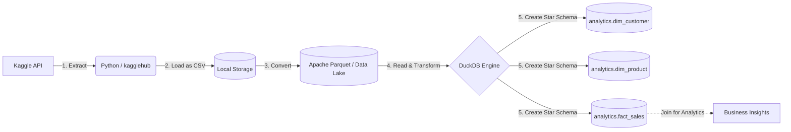

# 🦆 Retail Sales ELT Pipeline: Local-First Data Lakehouse with DuckDB

## 📌 Project Overview
Proyek ini mendemonstrasikan pembangunan **End-to-End ELT (Extract, Load, Transform) Pipeline** menggunakan dataset Retail Sales dari Kaggle. Alih-alih menggunakan infrastruktur cloud yang berat, proyek ini mengadopsi arsitektur **Local-First Data Lakehouse** yang modern, memanfaatkan format kolom (Parquet) dan mesin analitik in-process (DuckDB) untuk memproses dan memodelkan data menjadi **Star Schema**.

Proyek ini menyoroti kemampuan dalam:
- Ingesting data secara programatik dari sumber eksternal (Kaggle).
- Konversi format data mentah (CSV) ke format analitik yang efisien (Parquet).
- Dimensional Modeling (Star Schema) menggunakan SQL.
- Feature Engineering langsung di dalam layer database.

---

## 🏗️ Architecture Diagram

### 📊 Menjalankan Dashboard Visualisasi
Setelah pipeline selesai dijalankan dan file `retail_warehouse.db` terbentuk, Anda dapat memvisualisasikan datanya:
1. Install dependencies: `pip install -r requirements.txt`
2. Jalankan aplikasi Streamlit: `streamlit run app/app.py`
3. Buka browser di `http://localhost:8501`
